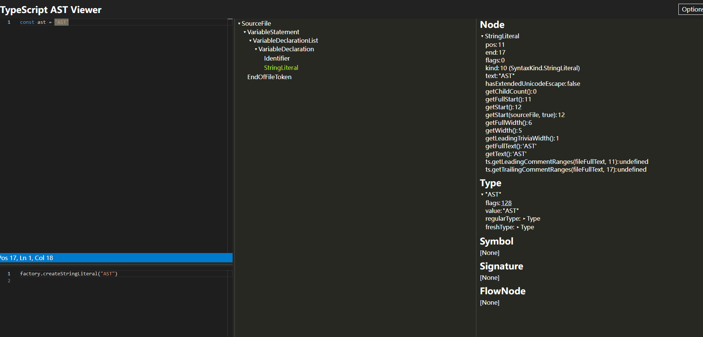

# 代码分析

## 为什么需要代码分析

随着Web的应用越来越复杂，前端开发也演变成了多团队/多角色协同开发模式，随着代码量、仓库数量、依赖复杂度的增加，导致开发者遇到的挑战也越来越大，也会遇到各种依赖治理的难题：

- 问题一：升级公司的组件库，但是不清楚业务团队对当前版本的真实调用情况，因此很难评估升级影响。
- 问题二：公共组件库不敢轻易修改和下线已有的API，因为不清楚哪些项目对它依赖会受到影响。只能选择向后兼容的方式，导致框架越来越臃肿。
- 问题三：修改全局变量导致的变量名污染问题
- 问题四：一些过时的API使用问题

## 代码分析的作用

对应用进行代码静态分析，主动发现、检测、预防因代码不规范等而产生的问题，帮助团队成员提高代码质量。

## 代码分析实现原理

通过扫描业务团队项目，找出所有需要分析的代码文件，并以此将其解析成AST，然后 遍历各级AST节点，按照分析指标对API调用等进行分析统计，等分析完所有文件后，整理输出分析结果。

## 什么是AST

抽象语法树 (Abstract Syntax Tree)，简称 AST，它是源代码语法结构的一种抽象表示。它以树状的形式表现编程语言的语法结构，树上的每个节点都表示源代码中的一种结构。

代码中常见的字面量、标识符、表达式、语句、模块语法、class 语法等语句都有各自对应的 AST 节点类型。

