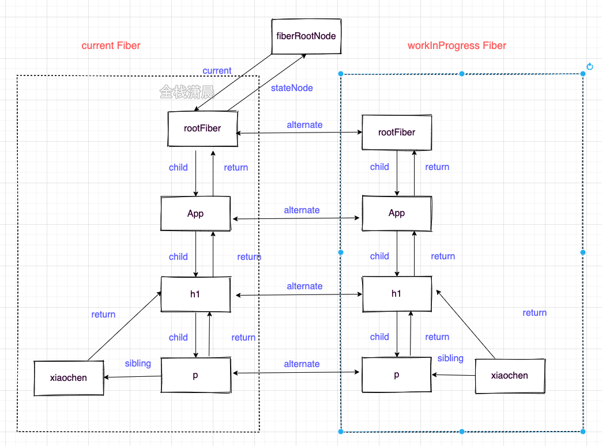

# react源码架构

react核心可以用UI = fn(state)来表示，函数式编程风格， 可以拆成以下两部分来表示

```javascript
const state = reconcile(update)
const UI = commit(state)
```

fn可以分为如下一个部分

- Scheduler（调度器）：排序优先级，让优先级高的任务先进行reconcile
- Reconciler（协调器）: 找出哪些节点发生变化，并打上不同的Flags
- Renderer（渲染器）: 将Reconciler中打好标签的节点渲染到视图上

调用栈主要分为三部分，入口 ，render阶段，commit阶段

 ```mermaid
 graph TB;
     入口阶段-->render-->|创建根的fiber节点|createRootImpl-->|初始化合成事件|listenToNativeEvent
     render阶段-->|首次渲染非批量更新|unbatchedUpdates-->|排列任务的优先级|scheduleUpdateOnFiber-->performUnitWork;
     performUnitWork-->beginWork-->|创建或者对比fiber节点|reconcileChildren;
     performUnitWork-->completeWork-->|创建真实的元素|createInstance;
     commit阶段-->commitRoot-->runWithPriority;
     runWithPriority-->|操作真实节点前|commitBeforeMutationEffects
     runWithPriority -->|操作真实节点并把副作用应用到节点上|commitMutationEffects
     runWithPriority-->|操作真实节点后|commitLayoutEffects;
 ```


## Fiber双缓存

双缓存是指存在两颗Fiber树，current Fiber树描述了当前呈现的dom树，workInProgress Fiber是正在更新的Fiber树，这两颗Fiber树都是在内存中运行的，在workInProgress Fiber构建完成之后会将它作为current Fiber应用到dom上

在mount时（首次渲染），会根据jsx对象（Class Component或的render函数者Function Component的返回值），构建Fiber对象，形成Fiber树，然后这颗Fiber树会作为current Fiber应用到真实dom上，在update（状态更新时如setState）的时候，会根据状态变更后的jsx对象和current Fiber做对比形成新的workInProgress Fiber，然后workInProgress Fiber切换成current Fiber应用到真实dom就达到了更新的目的，而这一切都是在内存中发生的，从而减少了对dom好性能的操作



结构如下：

```javascript
function FiberNode(
  tag: WorkTag,
  pendingProps: mixed,
  key: null | string,
  mode: TypeOfMode,
) {
  // 作为静态数据结构的属性
  // Fiber对应组件的类型 Function/Class/Host...
  this.tag = tag;
  // key属性
  this.key = key;
  // 大部分情况同type，某些情况不同，比如FunctionComponent使用React.memo包裹
  this.elementType = null;
  // 对于 FunctionComponent，指函数本身，对于ClassComponent，指class，对于HostComponent，指DOM节点tagName
  this.type = null;
  // Fiber对应的真实DOM节点
  this.stateNode = null;

  // 用于连接其他Fiber节点形成Fiber树
  // 指向父节点的Fiber节点
  this.return = null;
  // 指向子Fiber节点
  this.child = null;
  // 指向右边第一个兄弟节点
  this.sibling = null;
  this.index = 0;

  this.ref = null;

  // 作为动态的工作单元的属性
  // 保存本次更新造成的状态改变相关信息
  this.pendingProps = pendingProps;
  this.memoizedProps = null;
  this.updateQueue = null;
  this.memoizedState = null;
  this.dependencies = null;

  this.mode = mode;
  // 保存本次更新会造成的DOM操作
  this.effectTag = NoEffect;
  this.nextEffect = null;

  this.firstEffect = null;
  this.lastEffect = null;

  // 调度优先级相关
  this.lanes = NoLanes;
  this.childLanes = NoLanes;

  // 指向该fiber在另一次更新时对应的fiber
  this.alternate = null;
```

## scheduler

Scheduler的作用是调度任务，react15没有Scheduler这部分，所以所有任务没有优先级，也不能中断，只能同步执行。

在Scheduler中的每的每个任务的优先级使用过期时间表示的，如果一个任务的过期时间离现在很近，说明它马上就要过期了，优先级很高，如果过期时间很长，那它的优先级就低，没有过期的任务存放在timerQueue中，过期的任务存放在taskQueue中，timerQueue和timerQueue都是小顶堆，所以peek取出来的都是离现在时间最近也就是优先级最高的那个任务，然后优先执行它。

## Lane模型

react之前的版本用==`expirationTime`==属性代表优先级，该优先级和IO不能很好的搭配工作（io的优先级高于cpu的优先级），现在有了更加细粒度的优先级表示方法Lane，Lane用二进制位表示优先级，二进制中的1表示位置，同一个二进制数可以有多个相同优先级的位，这就可以表示‘批’的概念，而且二进制方便计算。

```javascript
//ReactFiberLane.js
export const NoLanes: Lanes = /*                        */ 0b0000000000000000000000000000000;
export const NoLane: Lane = /*                          */ 0b0000000000000000000000000000000;

export const SyncLane: Lane = /*                        */ 0b0000000000000000000000000000001;
export const SyncBatchedLane: Lane = /*                 */ 0b0000000000000000000000000000010;

export const InputDiscreteHydrationLane: Lane = /*      */ 0b0000000000000000000000000000100;
const InputDiscreteLanes: Lanes = /*                    */ 0b0000000000000000000000000011000;

const InputContinuousHydrationLane: Lane = /*           */ 0b0000000000000000000000000100000;
const InputContinuousLanes: Lanes = /*                  */ 0b0000000000000000000000011000000;

export const DefaultHydrationLane: Lane = /*            */ 0b0000000000000000000000100000000;
export const DefaultLanes: Lanes = /*                   */ 0b0000000000000000000111000000000;

const TransitionHydrationLane: Lane = /*                */ 0b0000000000000000001000000000000;
const TransitionLanes: Lanes = /*                       */ 0b0000000001111111110000000000000;

const RetryLanes: Lanes = /*                            */ 0b0000011110000000000000000000000;

export const SomeRetryLane: Lanes = /*                  */ 0b0000010000000000000000000000000;

export const SelectiveHydrationLane: Lane = /*          */ 0b0000100000000000000000000000000;

const NonIdleLanes = /*                                 */ 0b0000111111111111111111111111111;

export const IdleHydrationLane: Lane = /*               */ 0b0001000000000000000000000000000;
const IdleLanes: Lanes = /*                             */ 0b0110000000000000000000000000000;

export const OffscreenLane: Lane = /*                   */ 0b1000000000000000000000000000000;
```

## reconciler 

Reconciler发生在render阶段，render阶段会分别为节点执行beginWork和completeWork，或者计算state，对比节点的差异，为节点赋值相应的effectFlags（对应dom节点的增删改）

协调器是在render阶段工作的，简单一句话概括就是Reconciler会创建或者更新Fiber节点。在mount的时候会根据jsx生成Fiber对象，在update的时候会根据最新的state形成的jsx对象和current Fiber树对比构建workInProgress Fiber树，这个对比的过程就是diff算法。

diff算法发生在render阶段的reconcileChildFibers函数中，diff算法分为单节点的diff和多节点的diff（例如一个节点中包含多个子节点就属于多节点的diff），单节点会根据节点的key和type，props等来判断节点是复用还是直接新创建节点，多节点diff会涉及节点的增删和节点位置的变化

reconcile时会在这些Fiber上打上Flags标签，在commit阶段把这些标签应用到真实dom上，这些标签代表节点的增删改，如

```javascript
//ReactFiberFlags.js
export const Placement = /*             */ 0b0000000000010;
export const Update = /*                */ 0b0000000000100;
export const PlacementAndUpdate = /*    */ 0b0000000000110;
export const Deletion = /*              */ 0b0000000001000;
```

render阶段遍历Fiber树类似dfs的过程，‘捕获’阶段发生在beginWork函数中，该函数做的主要工作是创建Fiber节点，计算state和diff算法，‘冒泡’阶段发生在completeWork中，该函数主要是做一些收尾工作，例如处理节点的props、和形成一条effectList的链表，该链表是被标记了更新的节点形成的链表

```javascript
function App() {
  return (
   	<>
      <h1>
        <p>count</p> xiaochen
      </h1>
    </>
  )
}
```


```javascript
function App() {
  const [count, setCount] = useState(0);
  return (
   	 <>
      <h1
        onClick={() => {
          setCount(() => count + 1);
        }}
      >
        <p title={count}>{count}</p> xiaochen
      </h1>
    </>
  )
}
```

如果p和h1节点更新了则effectList如下，从rootFiber->h1->p,，顺便说下fiberRoot是整个项目的根节点，只存在一个，rootFiber是应用的根节点，可能存在多个，例如多个`ReactDOM.render(<App />, document.getElementById("root"));`创建多个应用节点


## renderer


Renderer发生在commit阶段，commit阶段遍历effectList执行对应的dom操作或部分生命周期。

Renderer是在commit阶段工作的，commit阶段会遍历render阶段形成的effectList，并执行真实dom节点的操作和一些生命周期，不同平台对应的Renderer不同，例如浏览器对应的就是react-dom。

commit阶段发生在commitRoot函数中，该函数主要遍历effectList，分别用三个函数来处理effectList上的节点，这三个函数是commitBeforeMutationEffects、commitMutationEffects、commitLayoutEffects，他们主要做的事情如下


## concurrent

它是一类功能的合集（如fiber、schduler、lane、suspense），其目的是为了提高应用的响应速度，使应用cpu密集型的更新不在那么卡顿，其核心是实现了一套异步可中断、带优先级的更新。

我们知道一般浏览器的fps是60Hz，也就是每16.6ms会刷新一次，而js执行线程和GUI也就是浏览器的绘制是互斥的，因为js可以操作dom，影响最后呈现的结果，所以如果js执行的时间过长，会导致浏览器没时间绘制dom，造成卡顿。react会在每一帧分配一个时间（时间片）给js执行，如果在这个时间内js还没执行完，那就要暂停它的执行，等下一帧继续执行，把执行权交回给浏览器去绘制。
