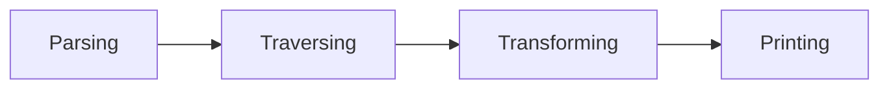

# AST

## AST是什么？

> 抽象语法树 (Abstract Syntax Tree)，简称 AST，它是源代码语法结构的一种抽象表示。它以树状的形式表现编程语言的语法结构，树上的每个节点都表示源代码中的一种结构

简单来说AST就是一个深度嵌套对象，对象能够描述代码的所有信息，一个 AST 只包含与分析源文本有关的信息，而跳过任何其他在解析文本时使用的额外内容（例如什么分号，函数参数中的逗号之类的对程序没有意义的东西）。

AST生成分为两个步骤：

- 词法分析，扫描输入的源代码字符串，生成一系列词法单元（token）。token是一个不可分割的最小单元。这些词法单元包括数字、表单符号、运算符等。词法单元都是独立的，最终整个代码将被分割进一个tokens列表。该阶段我们并不关心每一行代码是通过什么方式组合在一起的。

  ```javascript
  const a = 1;
  [{
      type: 'declaration',
      value: 'const'
  }, {
      type:'identifier',
      value: 'a'
  }, {
      type: 'paren',
      value: '='
  }, {
      type: 'literal',
      value: '1'
  }]
  ```

- 语法分析：将词法分析出来的 token 转化成有语法含义的抽象语法树结构。同时，验证语法，语法如果有错的话，抛出语法错误。

```javascript
{
    type: 'Program'，
    body: [{
        type: 'declaration',
        value: 'const',
        declarations: [
            {
                type: 'identifier'，
                value: 'a'
            },
            {
                type: 'paren'，
                value: '='
            },
            {
                type: 'literal',
                value: '1'
            }
        ]
    }]
}
```


### 常用节点类型

1. literal（字面量）：本身语义代表了一个值

   ```javascript
   let name = 'ast'         // ast ---> StringLiteral 字符串字面量
   let age = 30             // 30 ---> NumberLiteral 数字字面量
   let isMan = true         // true ---> BooleanLiteral 布林字面量
   const reg = /\d/;       // /\d/ ---> RegExpLiteral 正则字面量
   ```

2. Identifier(标识符) : 变量名、属性名、参数名等等一系列声明和引用的名字。

   ```javascript
   import { request } from 'framework';   // request              ---> Identifier
   let name = 'iceman';                   // name                 ---> Identifier
   const age = 30;                        // age                  ---> Identifier
   function talk(name) {                  // talk, name           ---> Identifier
     console.log(name);                 // console, log, name   ---> Identifier
   }
   const obj = {                          // obj                  ---> Identifier
     name: 'guang'                      // name                 ---> Identifier
   }
   ```

3. Statement(语句) : 代码执行的最小单位。

   ```javascript
   return 'ast';                       // ReturnStatement
   if (age > 35) {}                    // IfStatement
   throw new Error('error')            // ThrowStatement
   try {} catch(e) {}                  // TryStatement
   for (let i = 0; i < 5; i++) {}      // ForStatem
   ```

4. Declaration(声明) : 声明语句是一种特殊的 Statement。

   ```javascript
   const listlen = 1;            // VariableDeclaration
   let listName = 'user';        // VariableDeclaration
   function getInfo(info) {      // FunctionDeclaration
     if(info.isRun){
         return info.name;
     }
     return '';
   }         
   class Car {                   // ClassDeclaration
     constructor() {}
     method() {}
   }
   ```

5. Import : 导入模块，属于一种特殊的声明语句，有三种类型 ImportSpecifier | ImportDefaultSpecifier | ImportNamespaceSpecifier。

   ```javascript
   import { environment } from 'AST';        // named import
   import { request as req } from 'AST';     // namespaced import
   import api from 'AST';                    // default import
   import * as APP from 'AST';               // namespaced imort
   ```

6. Export : 导出模块，也属于一种特殊的声明，有三种类型 ExportAllDeclaration | ExportDefaultDeclaration | ExportNamedDeclaration。

   ```javascript
   export * from './AST';
   export default 'AST';
   export const ast = 'AST';
   ```

常用节点含义对照表 


## AST有什么用

### 代码编译

- `Babel`，将 ES6 JavaScript 转化为 ES5 JavaScript。
- `TypeScript`，将 TypeScript 转化为 JavaScript。
- `Sass`，将 Sass 转化为 CSS。

### 代码加工

- `Prettier`，代码美化，风格格式化。
- `ESLint`, 修复语法错误
- `uglifyJS`，代码压缩，混淆。
- `@vue/compiler-dom`，可以将 Vue 文件代码拆分成 template、script、style 三种代码类型片段。

### 代码分析

- `ESLint`，代码语法检查。
- `Webpack`，代码模块打包分析。

基于AST的代码处理工具工作一般分为4个阶段：




1. **Parsing（解析）** ：这个过程由编译器实现，会经过词法分析和语法分析两个过程，生成 `AST` 

2. **Traversing（遍历）：** 深度优先遍历 `AST` ，访问树上各个节点的信息

3. **Transforming（修改）：** 在遍历的过程中可对节点信息进行修改/转化，生成新的 `AST`

4. **Printing（输出）：** 将转化后新的 `AST` 输出成新的代码块

 

##  生成Tokens

整体思路就是通过遍历字符串的方式，对每个字符按照一定的规则进行`switch case`，最终生成`tokens`数组

```javascript
function tokenizer (input) {
  let current = 0; //记录当前访问的位置
  let tokens = [] // 最终生成的tokens
  // 循环遍历input
  while (current < input.length) {
    let char = input[current];
    // 如果字符是开括号，我们把一个新的token放到tokens数组里，类型是`paren`
    if (char === '(') {
      tokens.push({
        type: 'paren',
        value: '(',
      });
      current++;
      continue;
    }
    // 闭括号做同样的操作
    if (char === ')') {
      tokens.push({
        type: 'paren',
        value: ')',
      });
      current++;
      continue;
    }
    //空格检查，我们关心空格在分隔字符上是否存在，但是在token中他是无意义的
    let WHITESPACE = /\s/;
    if (WHITESPACE.test(char)) {
      current++;
      continue;
    }
    //接下来检测数字，这里解释下 如果发现是数字我们如 add 22 33 这样
    //我们是不希望被解析为2、2、3、3这样的，我们要遇到数字后继续向后匹配直到匹配失败
    //这样我们就能截取到连续的数字了
    let NUMBERS = /[0-9]/;
    if (NUMBERS.test(char)) {
      let value = '';
      while (NUMBERS.test(char)) {
        value += char;
        char = input[++current];
      }
      tokens.push({ type: 'number', value });
      continue;
    }

    // 接下来检测字符串,这里我们只检测双引号，和上述同理也是截取连续完整的字符串
    if (char === '"') {
      let value = '';
      char = input[++current];
      while (char !== '"') {
        value += char;
        char = input[++current];
      }
      char = input[++current];
      tokens.push({ type: 'string', value });
      continue;
    }
    // 最后一个检测的是name 如add这样，也是一串连续的字符，但是他是没有“”的
    let LETTERS = /[a-z]/i;
    if (LETTERS.test(char)) {
      let value = '';
      while (LETTERS.test(char)) {
        value += char;
        char = input[++current];
      }
      tokens.push({ type: 'name', value });
      continue;
    }
    // 容错处理，如果我们什么都没有匹配到，说明这个token不在我们的解析范围内
    throw new TypeError('I dont know what this character is: ' + char);
  }
  return tokens
}
```


## 生成AST

遍历tokens，生成对应的节点

```javascript
function parser (tokens) {
  let current = 0; 
  //walk函数辅助我们遍历整个tokens
  function walk () {
    let token = tokens[current]
    // 现在就是遍历出每一个token，根据其类型生成对应的节点
    if (token.type === 'number') {
      current++
      return {
        type: 'NumberLiteral',
        value: token.value
      }
    }
    if (token.type === 'string') {
      current++;
      return {
        type: 'StringLiteral',
        value: token.value,
      };
    }
    //这里处理调用语句
    if (token.type === 'paren' && token.value === "(") {
      token = tokens[++current]
      //这里以一个例子解释(add 2 3) 这样的代码 "(" 就是 paren token ，而接下来的node其实就是那个 name 类型的token "add"
      let node = {
        type: "CallExpression",
        value: token.value,
        params: []
      }
      token = tokens[++current];
      //这里我们通过递归调用不断的读取参数
      while (
        (token.type !== 'paren') || (token.type === 'paren' && token.value !== ')')
      ) {
        node.params.push(walk())
        token = tokens[current] //因为参数的if判断里会让 current++ 实际上就是持续向后遍历了tokens,然后将参数推入params
      }
      // 当while中断后就说明参数读取完了，现在下一个应该是")"，所以我们++越过
      current++
      return node // 最终将CallExpression节点返回了
    }
    //当然这里做了容错处理，如果没有匹配到预计的类型，就说明出现了，parse无法识别的token
    throw new TypeError(token.type);
  }
  // 现在我们创建AST，树的最根层就是Program
  let ast = {
    type: 'Program',
    body: [],
  };
  //然后我们通过调用walk遍历tokens将tokens内的对象，转化为AST的节点，完成AST的构建
  while (current < tokens.length) {
    ast.body.push(walk());
  }
  return ast;
}
```

## 遍历和访问生成好的AST

现在已经有AST了，然后我们希望能够通过访问器访问不同的节点，当遇到不同的节点的时候，调用访问器的不同函数

```javascript
function traverse (ast, visitor) {
  //遍历数组，在遍历数组的同时会调用traverseNode来遍历节点
  function traverseArray (array, parent) {
    array.forEach(child => {
      traverseNode(child, parent)
    });
  }
  function traverseNode (node, parent) {
    // 判断访问器中是否有合适处理该节点的函数
    let methods = visitor[node.type];
    // 如果有就执行enter函数，因为此时已经进入这个节点了
    if (methods && methods.enter) {
      methods.enter(node, parent);
    }
    //接下来就根据node节点类型来处理了
    switch (node.type) {
      case 'Program':
        traverseArray(node.body, node); //如果你是ast的根部，就相当于树根，body中的每一项都是一个分支
        break;
      case 'CallExpression':
        traverseArray(node.params, node); //这个和Program一样处理，但是这里是为了遍历params,上面是为了遍历分支
        break;
      // 字符串和数字没有子节点需要访问直接跳过
      case 'NumberLiteral':
      case 'StringLiteral':
        break;
      // 最后容错处理
      default:
        throw new TypeError(node.type);
    }
    // 当执行到这里时，说明该节点（分支）已经遍历到尽头了，执行exit
    if (methods && methods.exit) {
      methods.exit(node, parent);
    }
  }
  //我们从ast开始进行节点遍历，因为ast没有父节点所以传入null
  traverseNode(ast, null);
}
```

## Transformer转化

```javascript
function transformer (ast) {
  // 将要被返回的新的AST
  let newAst = {
    type: 'Program',
    body: [],
  };
  // 这里相当于将在旧的AST上创建一个_content,这个属性就是新AST的body，因为是引用，所以后面可以直接操作就的AST
  ast._context = newAst.body;
  // 用之前创建的访问器来访问这个AST的所有节点
  traverser(ast, {
    // 针对于数字片段的处理
    NumberLiteral: {
      enter (node, parent) {
        // 创建一个新的节点，其实就是创建新AST的节点，这个新节点存在于父节点的body中
        parent._context.push({
          type: 'NumberLiteral',
          value: node.value,
        });
      },
    },

    // 针对于文字片段的处理
    StringLiteral: {
      enter (node, parent) {
        parent._context.push({
          type: 'StringLiteral',
          value: node.value,
        });
      },
    },

    // 对调用语句的处理
    CallExpression: {
      enter (node, parent) {
        // 在新的AST中如果是调用语句，type是`CallExpression`，同时他还有一个`Identifier`，来标识操作
        let expression = {
          type: 'CallExpression',
          callee: {
            type: 'Identifier',
            name: node.value,
          },
          arguments: [],
        };
        // 在原来的节点上再创建一个新的属性，用于存放参数 这样当子节点修改_context时，会同步到expression.arguments中，这里用的是同一个内存地址
        node._context = expression.arguments;
        // 这里需要判断父节点是否是调用语句，如果不是，那么就使用`ExpressionStatement`将`CallExpression`包裹，因为js中顶层的`CallExpression`是有效语句
        if (parent.type !== 'CallExpression') {
          expression = {
            type: 'ExpressionStatement',
            expression: expression,
          };
        }
        parent._context.push(expression);
      },
    }
  });
  return newAst;
}
```

## 新代码生成

```javascript
function codeGenerator(node) {
  // 我们以节点的种类拆解(语法树)
  switch (node.type) {
    // 如果是Progame,那么就是AST的最根部了，他的body中的每一项就是一个分支，我们需要将每一个分支都放入代码生成器中
    case 'Program':
      return node.body.map(codeGenerator)
        .join('\n');
    // 如果是声明语句注意看新的AST结构，那么在声明语句中expression，就是声明的标示，我们以他为参数再次调用codeGenerator
    case 'ExpressionStatement':
      return (
        codeGenerator(node.expression) + ';'
      );
    // 如果是调用语句，我们需要打印出调用者的名字加括号，中间放置参数如生成这样"add(2,2)",
    case 'CallExpression':
      return (
        codeGenerator(node.callee) +  '(' + node.arguments.map(codeGenerator).join(', ') + ')'
      );
      
    // 如果是识别就直接返回值 如： (add 2 2),在新AST中 add就是那个identifier节点
    case 'Identifier':
      return node.name;
    // 如果是数字就直接返回值
    case 'NumberLiteral':
      return node.value;
    // 如果是文本就给值加个双引号
    case 'StringLiteral':
      return '"' + node.value + '"';
    // 容错处理
    default:
      throw new TypeError(node.type);
  }
}
```


## 编译器Parser

`Babel`就是一个最常用的Javascript编译器,它能够转译 `ECMAScript 2015+` 的代码，使它在旧的浏览器或者环境中也能够运行，工作过程分为三个部分

- **Parse(解析)** 将源代码转换成抽象语法树，树上有很多的estree节点
- **Transform(转换)** 对抽象语法树进行转换
- **Generate(代码生成)** 将上一步经过转换过的抽象语法树生成新的代码

babel插件介绍：

- **@babel/parser** 可以把源代码转换成AST
- **@babel/traverse** 用于对 `AST` 的遍历，维护了整棵树的状态，并且负责替换、移除和添加节点
- **@Babel/generate **可以把`AST`生成源码
- **@babel/type **包含了构造，验证以及变换AST节点的方法
- **@babel/core** Babel的编译器，核心API都在里面

## 使用Babel修改函数名称

```javascript
const parser = require('@babel/parser')
const traverse = require('@babel/traverse')
const generator = require('@babel/generator')

const code = `
const hello = () => {};
`
const ast = parser.parse(code)

const visitor = {
  Identifier(path) {
    const { node } = path
    if (node.name === 'hello') {
      node.name = 'world'
    }
  },
}

traverse.default(ast, visitor)

const result = generator.default(ast, {}, code)
```


## 箭头函数转换

```javascript
const parser = require('@babel/parser')
const traverse = require('@babel/traverse')
const generator = require('@babel/generator')

const code = `
const sum = (a, b) => {
    return a + b;
}
`
const ast = parser.parse(code)

const visitor = {
  ArrowFunctionExpression(path) {
    const { node } = path
    node.type = 'FunctionExpression'
  },
}

traverse.default(ast, visitor)
const result = generator.default(ast, {}, code)
```

## 简单版Eslint

```javascript
const core = require('@babel/core')

const code = `
var a = 1;
console.log(a);
var b = 2;
`
const eslintPlugin = ({ fix }) => {
  return {
    pre(file) {
      file.set('errors', [])
    },
    visitor: {
      CallExpression(path, state) {
        const errors = state.file.get('errors')
        const { node } = path
        if (node.callee.object && node.callee.object.name === 'console') {
          errors.push(
            path.buildCodeFrameError(`代码中不能出现console语句`, Error) //抛出一个语法错误
          )
          if (fix) {
            //如果启动了fix，就删掉该节点
            path.parentPath.remove()
          }
        }
      },
    },
    //遍历后
    post(file) {
      console.log(...file.get('errors'))
    },
  }
}
let targetSource = core.transform(code, {
  plugins: [eslintPlugin({ fix: true })],
})

console.log(targetSource.code)
```

## 代码压缩

```javascript
const { transformSync } = require('@babel/core')

const sourceCode = `
 function getAge(){
   var age = 12;
   console.log(age);
   var name = 'zhufeng';
   console.log(name);
 }
 `
const uglifyPlugin = () => {
  return {
    visitor: {
      Scopable(path) {
        Object.entries(path.scope.bindings).forEach(([key, binding]) => {
          const newName = path.scope.generateUid() //在当前作用域内生成一个新的uid，并且不会和任何本地定义的变量冲突的标识符
          binding.path.scope.rename(key, newName)
        })
      },
    },
  }
}

const { code } = transformSync(sourceCode, {
  plugins: [uglifyPlugin()],
})
console.log(code)
```

