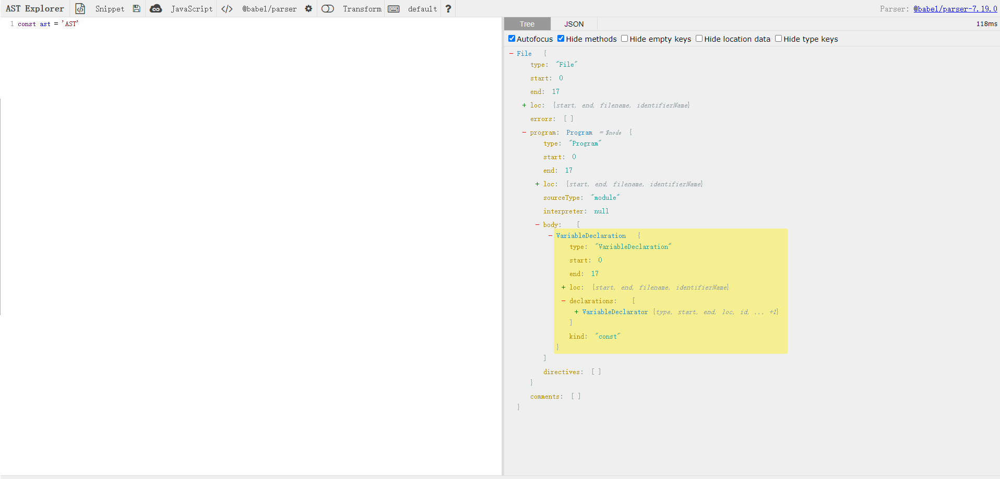
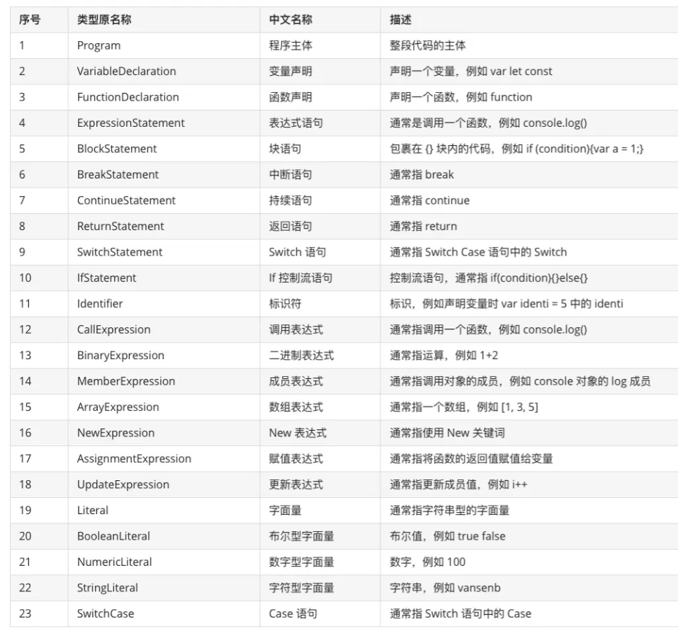
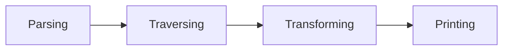

# AST

## AST是什么？

> 抽象语法树 (Abstract Syntax Tree)，简称 AST，它是源代码语法结构的一种抽象表示。它以树状的形式表现编程语言的语法结构，树上的每个节点都表示源代码中的一种结构

简单来说AST就是一个深度嵌套对象，对象能够描述代码的所有信息，一个 AST 只包含与分析源文本有关的信息，而跳过任何其他在解析文本时使用的额外内容（例如什么分号，函数参数中的逗号之类的对程序没有意义的东西）。

AST生成分为两个步骤：

- 词法分析，扫描输入的源代码字符串，生成一系列词法单元（token）。token是一个不可分割的最小单元。这些词法单元包括数字、表单符号、运算符等。词法单元都是独立的，最终整个代码将被分割进一个tokens列表。该阶段我们并不关心每一行代码是通过什么方式组合在一起的。

  ```javascript
  const a = 1;
  [{
      type: 'declaration',
      value: 'const'
  }, {
      type:'identifier',
      value: 'a'
  }, {
      type: 'paren',
      value: '='
  }, {
      type: 'literal',
      value: '1'
  }]
  ```

- 语法分析：将词法分析出来的 token 转化成有语法含义的抽象语法树结构。同时，验证语法，语法如果有错的话，抛出语法错误。

```javascript
{
    type: 'Program'，
    body: [{
        type: 'declaration',
        value: 'const',
        declarations: [
            {
                type: 'identifier'，
                value: 'a'
            },
            {
                type: 'paren'，
                value: '='
            },
            {
                type: 'literal',
                value: '1'
            }
        ]
    }]
}
```



### 常用节点类型

1. literal（字面量）：本身语义代表了一个值

   ```javascript
   let name = 'ast'         // ast ---> StringLiteral 字符串字面量
   let age = 30             // 30 ---> NumberLiteral 数字字面量
   let isMan = true         // true ---> BooleanLiteral 布林字面量
   const reg = /\d/;       // /\d/ ---> RegExpLiteral 正则字面量
   ```

2. Identifier(标识符) : 变量名、属性名、参数名等等一系列声明和引用的名字。

   ```javascript
   import { request } from 'framework';   // request              ---> Identifier
   let name = 'iceman';                   // name                 ---> Identifier
   const age = 30;                        // age                  ---> Identifier
   function talk(name) {                  // talk, name           ---> Identifier
     console.log(name);                 // console, log, name   ---> Identifier
   }
   const obj = {                          // obj                  ---> Identifier
     name: 'guang'                      // name                 ---> Identifier
   }
   ```

3. Statement(语句) : 代码执行的最小单位。

   ```javascript
   return 'ast';                       // ReturnStatement
   if (age > 35) {}                    // IfStatement
   throw new Error('error')            // ThrowStatement
   try {} catch(e) {}                  // TryStatement
   for (let i = 0; i < 5; i++) {}      // ForStatem
   ```

4. Declaration(声明) : 声明语句是一种特殊的 Statement。

   ```javascript
   const listlen = 1;            // VariableDeclaration
   let listName = 'user';        // VariableDeclaration
   function getInfo(info) {      // FunctionDeclaration
     if(info.isRun){
         return info.name;
     }
     return '';
   }         
   class Car {                   // ClassDeclaration
     constructor() {}
     method() {}
   }
   ```

5. Import : 导入模块，属于一种特殊的声明语句，有三种类型 ImportSpecifier | ImportDefaultSpecifier | ImportNamespaceSpecifier。

   ```javascript
   import { environment } from 'AST';        // named import
   import { request as req } from 'AST';     // namespaced import
   import api from 'AST';                    // default import
   import * as APP from 'AST';               // namespaced imort
   ```

6. Export : 导出模块，也属于一种特殊的声明，有三种类型 ExportAllDeclaration | ExportDefaultDeclaration | ExportNamedDeclaration。

   ```javascript
   export * from './AST';
   export default 'AST';
   export const ast = 'AST';
   ```

常用节点含义对照表 



## 

## AST有什么用

### 代码编译

- `Babel`，将 ES6 JavaScript 转化为 ES5 JavaScript。
- `TypeScript`，将 TypeScript 转化为 JavaScript。
- `Sass`，将 Sass 转化为 CSS。

### 代码加工

- `Prettier`，代码美化，风格格式化。
- `ESLint`, 修复语法错误
- `uglifyJS`，代码压缩，混淆。
- `@vue/compiler-dom`，可以将 Vue 文件代码拆分成 template、script、style 三种代码类型片段。

### 代码分析

- `ESLint`，代码语法检查。
- `Webpack`，代码模块打包分析。

基于AST的代码处理工具工作一般分为4个阶段：




1. **Parsing（解析）** ：这个过程由编译器实现，会经过词法分析和语法分析两个过程，生成 `AST` 

2. **Traversing（遍历）：** 深度优先遍历 `AST` ，访问树上各个节点的信息

3. **Transforming（修改）：** 在遍历的过程中可对节点信息进行修改/转化，生成新的 `AST`

4. **Printing（输出）：** 将转化后新的 `AST` 输出成新的代码块


## 编译器Parser

`Babel`就是一个最常用的Javascript编译器,它能够转译 `ECMAScript 2015+` 的代码，使它在旧的浏览器或者环境中也能够运行，工作过程分为三个部分

- **Parse(解析)** 将源代码转换成抽象语法树，树上有很多的estree节点
- **Transform(转换)** 对抽象语法树进行转换
- **Generate(代码生成)** 将上一步经过转换过的抽象语法树生成新的代码

babel插件介绍：

- **@babel/parser** 可以把源代码转换成AST
- **@babel/traverse** 用于对 `AST` 的遍历，维护了整棵树的状态，并且负责替换、移除和添加节点
- **@Babel/generate **可以把`AST`生成源码
- **@babel/type **包含了构造，验证以及变换AST节点的方法
- **@babel/core** Babel的编译器，核心API都在里面